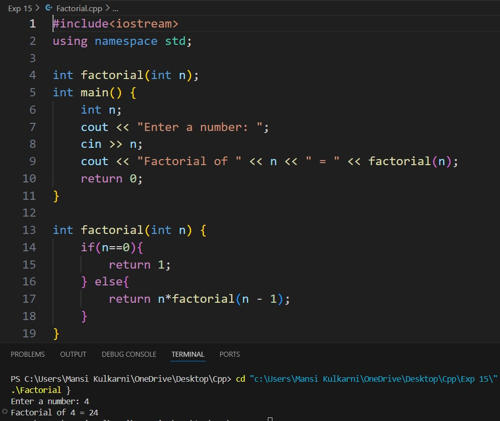

# Experiment 15
## Program 1
### Aim: 
Find the factorial of a number using recursion
### Software used: 
Visual Studio Code
### Theory:
Recursion is a programming technique where a function calls itself to solve smaller instances of the same problem. To find the factorial of a number using recursion, the function repeatedly calls itself by reducing the number until it reaches the base case.
###
The factorial of a number n (denoted as n!) is the product of all integers from 1 to n. The recursive process works by breaking down the calculation as:
n! = n * (n-1)!
The base case occurs when n is 0 or 1, as the factorial of 0 or 1 is defined as 1. Recursion stops when this base case is reached, and the results are propagated back up the recursive calls.
### Output:

### Conclusion:
We found the factorial of a number using recursion in C++. 

## Program 2
### Aim: 
Find the Fibonacci number in the Fibonacci sequence using recursion
### Software used: 
Visual Studio Code
### Theory:
The Fibonacci sequence is a series of numbers where each number is the sum of the two preceding ones, starting from 0 and 1. The recursive method to find the Fibonacci number at a particular position involves calling the function to compute the previous two Fibonacci numbers and adding them together.
### Output:

### Conclusion:
We found the fibonacci series for n number using recusion in C++.

## Program 3
### Aim: 
Find sum of n natural numbers using recursion, n is the value entered by user.
### Software used: 
Visual Studio Code
### Theory:
To calculate the sum of the first n natural numbers using recursion, the problem is broken down into smaller subproblems. The sum of the first n numbers is: Sum(n) = n + Sum(n-1)
The base case occurs when n reaches 1, as the sum of the first natural number (1) is simply 1. The recursive function adds the current number n to the result of Sum(n-1) and continues reducing the problem size until it reaches the base case, at which point the recursion terminates and returns the result.
### Output:

### Conclusion:
We learned how to add n numbers using recursion in C++.
